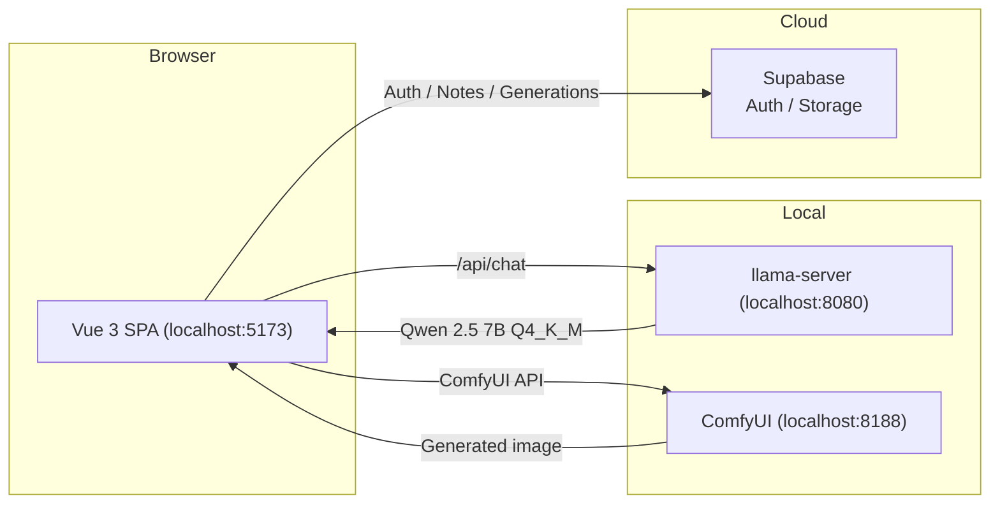
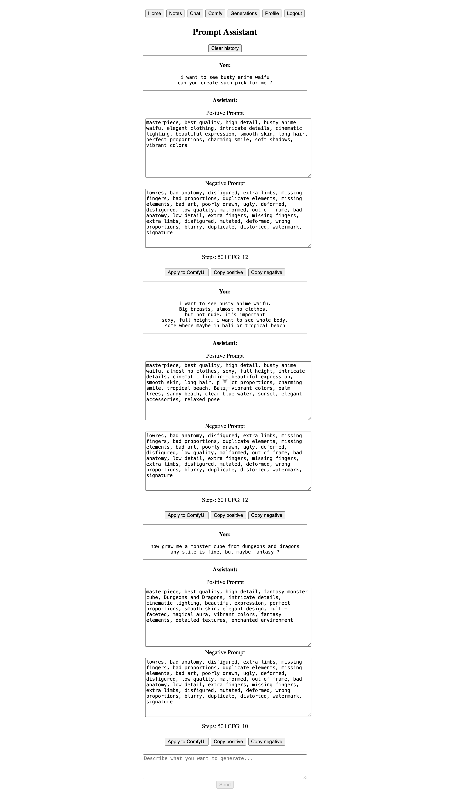
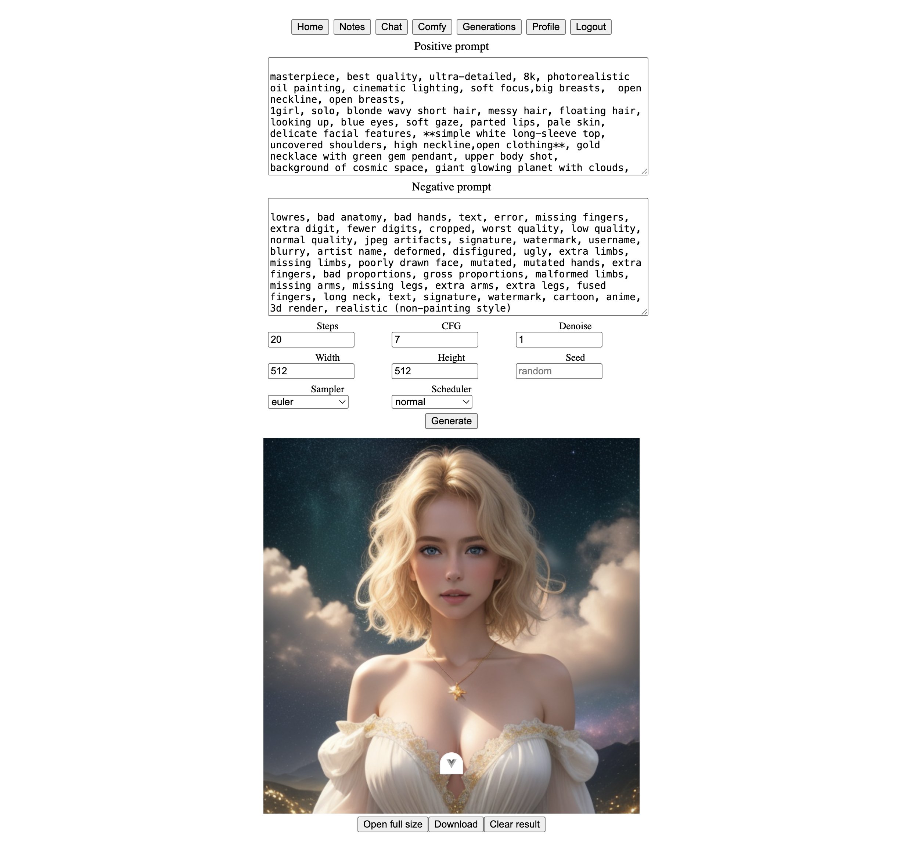
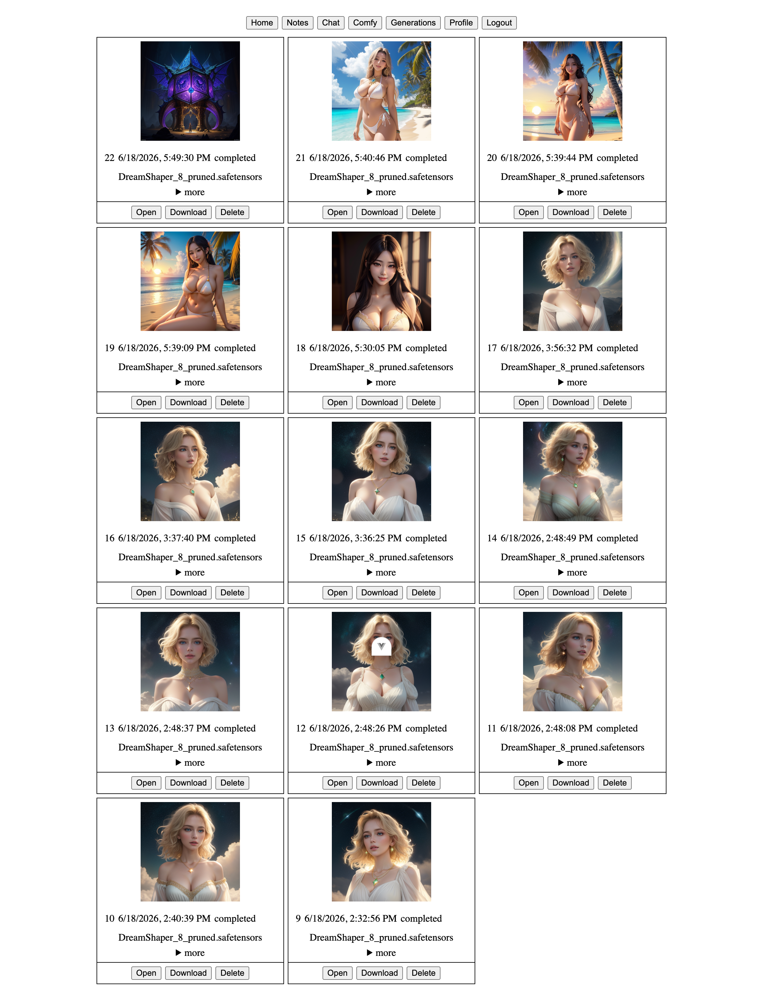
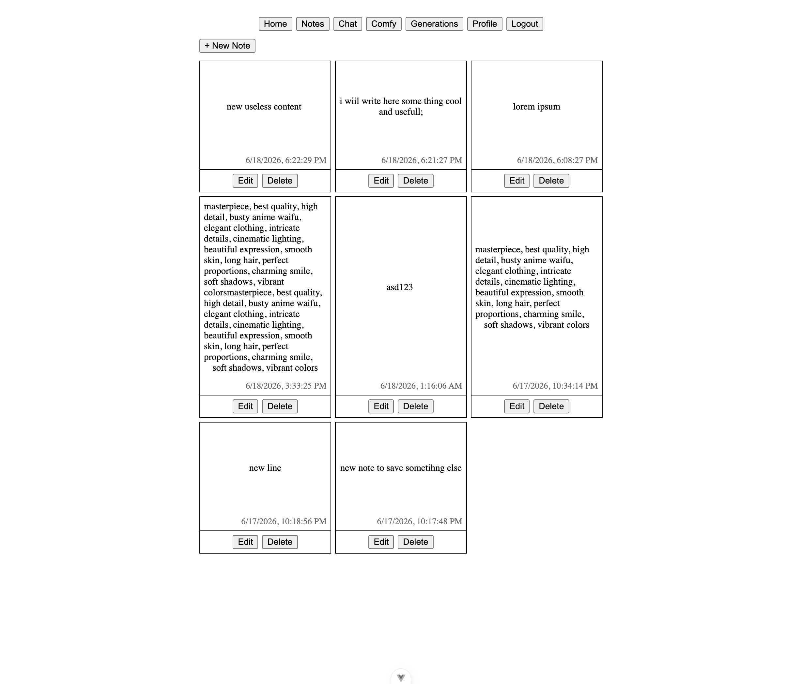

# ComfyChat

## Description

ComfyChat is a local-first Vue 3 SPA that connects three services into a streamlined AI image generation workflow:

- **Prompt Assistant** — a chat interface (Qwen 2.5 7B via `llama-server`) that turns rough ideas into detailed SD/ComfyUI prompts.
- **ComfyUI** — receives enhanced prompts and runs image generation.
- **Supabase** — handles authentication (email + password reset), notes, and generation history.

The app runs entirely against local AI services — nothing leaves your machine except auth data.

## Architecture



**Flow:**

1. User types a rough prompt in **Chat** → llama.cpp returns a detailed positive/negative prompt in JSON.
2. User clicks **Apply to ComfyUI** → the enhanced prompt fills the form on the **ComfyUI** page.
3. User tweaks parameters and clicks **Generate** → image is rendered and saved to Supabase.
4. The original user query is automatically stored as a **Note**.

> **Disclaimer** — This project is designed for **local development and testing only**. In production, AI and database interactions should be handled by a dedicated backend service (ideally containerised with Docker) rather than directly from the browser.

## Prerequisites

- [Vite+](https://viteplus.dev/) (`vp` CLI — included as dev dependency, used for all commands)
- [ComfyUI](https://github.com/comfyanonymous/ComfyUI) (local instance)
- [llama.cpp](https://github.com/ggml-org/llama.cpp) + Qwen 2.5 for prompt enhancement

## Environment

```sh
cp .env.example .env.local
```

Fill in your Supabase project URL and publishable key.

## Project Setup

```sh
vp install
```

## ComfyUI Setup

1. **Clone the repository:**
   ```sh
   git clone https://github.com/comfyanonymous/ComfyUI.git
   cd ComfyUI
   ```
2. **Create and activate a virtual environment:**
   ```sh
   python -m venv venv
   source venv/bin/activate
   ```
3. **Install dependencies:**
   ```sh
   pip install -r requirements.txt
   ```
4. **Run ComfyUI:**
   ```sh
   python main.py --enable-cors-header
   ```
5. **(Optional) Use the launch script:**
   ```sh
   ./comfy.sh
   ```

## llama.cpp Setup

`llama-server` downloads the model automatically via the `-hf` flag — no manual download needed.

```sh
./llama.sh
```

The dev server proxies `/api/chat` → `http://127.0.0.1:8080/v1/chat/completions`.

## Running Everything

```sh
# Terminal 1: ComfyUI
./comfy.sh

# Terminal 2: llama.cpp
./llama.sh

# Terminal 3: this project
vp dev
```

### Production Build

```sh
vp build
```

### Lint, Type Check & Format

```sh
vp check
```

## Screenshots

### 1



_Chat — user sends a rough idea, LLM returns an enhanced positive/negative prompt pair_

---

### 2



_ComfyUI — prompt applied from chat, parameters adjusted, generation queued_

---

### 3



_Generations — history of rendered images with their prompts_

---

### 4



_Notes — original user queries automatically saved after each chat message_
